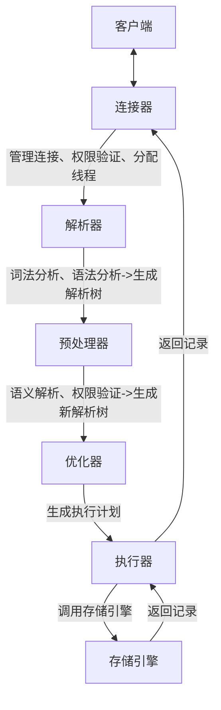

参考：
[全解MySQL之架构篇：自顶向下深入剖析MySQL整体架构！](https://developer.aliyun.com/article/1575323)
[执行一条 select 语句，期间发生了什么？](https://xiaolincoding.com/mysql/base/how_select.html#%E7%AC%AC%E4%BA%8C%E6%AD%A5-%E6%9F%A5%E8%AF%A2%E7%BC%93%E5%AD%98)
[SQL语句在MySQL中的执行过程](https://javaguide.cn/database/mysql/how-sql-executed-in-mysql.html)
[Java开发手册(黄山版)](https://github.com/alibaba/p3c/blob/master/Java%E5%BC%80%E5%8F%91%E6%89%8B%E5%86%8C%28%E9%BB%84%E5%B1%B1%E7%89%88%29.pdf)
[MySQL 慢 SQL & 优化方案](https://www.cnblogs.com/juno3550/p/14887672.html)
[老司机总结的12条 SQL 优化方案](https://developer.aliyun.com/article/1008410)
[sql优化的15个小技巧](https://blog.csdn.net/guoqi_666/article/details/122484535)

# 一、MySQL架构

MySQL Architecture with Pluggable Storage Engines:
https://dev.mysql.com/doc/refman/8.4/en/images/mysql-architecture.png


从上往下看，依次会分为网络连接层、系统服务层、存储引擎层、以及文件系统层
- 网络连接层：主要是指数据库连接池，会负责处理所有客户端接入的工作。
- 服务层：主要包含`SQL`接口、解析器、优化器以及缓存缓冲区四块区域。
- 存储引擎层：这里是指`MySQL`支持的各大存储引擎，如`InnoDB、MyISAM`等。
- 文件系统层：涵盖了所有的日志，以及数据、索引文件，位于系统硬盘上。

## 网络连接层

当一个客户端尝试与`MySQL`建立连接时，`MySQL`内部都会派发一条线程负责处理该客户端接下来的所有工作。而数据库的连接层负责的就是所有客户端的接入工作。若数据库连接建立成功，`MySQL`会“安排”一条线程维护当前客户端的连接，这条线程也会时刻标识着当前连接在干什么工作，可以通过`show processlist;`命令查询所有正在运行的线程及其工作详情。

连接建立成功后，`MySQL`与客户端之间会采用半双工的通讯机制工作。

>- 全双工：代表通讯的双方在同一时间内，即可以发送数据，也可以接收数据。
>- 半双工：代表同一时刻内，单方要么只能发送数据，要么只能接受数据。
>- 单工：当前连接只能发送数据或只能接收数据，也就是“单向类型的通道”。

### 数据库连接池

每个客户端连接数据库都需要一条线程去维护，但创建新的线程是需要一定的资源消耗的，而且线程资源不可能无限量创建。

`Connection Pool`的存在主要是为了复用线程、管理线程以及限制最大连接数的。一方面提升了性能，第二方面还节省了一定程度上的资源开销。

连接池的最大线程数可以通过参数`max-connections`来控制，如果到来的客户端连接超出该值时，新到来的连接都会被拒绝，关于最大连接数的一些命令主要有两条：

- `show variables like '%max_connections%';`：查询目前`DB`的最大连接数。
- `set GLOBAL max_connections = 200;`：修改数据库的最大连接数为指定值。

对于不同的机器配置，可以适当的调整连接池的最大连接数大小，以此可以在一定程度上提升数据库的性能。除了可以查询最大连接数外，`MySQL`本身还会对客户端的连接数进行统计，对于这点可以通过命令`show status like "Threads%";`查询。

## 系统服务层

`MySQL`大多数核心功能都位于这一层，包括客户端`SQL`请求解析、语义分析、查询优化、缓存以及所有的内置函数（例如：日期、时间、统计、加密函数...），所有跨引擎的功能都在这一层实现，譬如存储过程、触发器和视图等一系列服务。

主要包含`SQL`接口（SQL Interface）、解析器（Parser）、优化器（Optimizer）以及缓存（Caches&Buffers）相关的这些部分。

### SQL接口

`SQL`接口组件的主要作用就是负责处理客户端的`SQL`语句，当客户端连接建立成功之后，会接收客户端的`SQL`命令，比如`DML、DDL`语句以及存储过程、触发器等，当收到`SQL`语句时，`SQL`接口会将其分发给其他组件，然后等待接收执行结果的返回，最后会将其返回给客户端。

>简单来说，也就是`SQL`接口会作为客户端连接传递`SQL`语句时的入口，并且作为数据库返回数据时的出口。

对于这个组件主要有两个作用，第一是对于`SQL`语句的类型划分，第二则是触发器。

根据`SQL`的不同的作用，`SQL`分为五大类：

- `DML`：数据库操作语句，比如`update、delete、insert`等都属于这个分类。
- `DDL`：数据库定义语句，比如`create、alter、drop`等都属于这个分类。
- `DQL`：数据库查询语句，比如最常见的`select`就属于这个分类。
- `DCL`：数据库控制语句，比如`grant、revoke`控制权限的语句都属于这个分类。
- `TCL`：事务控制语句，例如`commit、rollback、setpoint`等语句属于这个分类。

再来聊一聊`MySQL`的触发器，这东西估计大部分小伙伴没用过，但它在有些情景下还较为实用，不过想要了解触发器是什么，首先咱们还得先理解存储过程。

>存储过程：是指提前编写好的一段较为常用或复杂`SQL`语句，然后指定一个名称存储起来，然后先经过编译、优化，完成后，这个“过程”会被嵌入到`MySQL`中。

也就是说，存储过程的本质就是一段预先写好并编译完成的`SQL`，而我们要聊的触发器则是一种特殊的存储过程，但 触发器 与 存储过程 的不同点在于：**存储过程需要手动调用后才可执行，而触发器可由某个事件主动触发执行**。
在`MySQL`中支持`INSERT、UPDATE、DELETE`三种事件触发，同时也可以通过`AFTER、BEFORE`语句声明触发的时机，是在操作执行之前还是执行之后。

>说简单一点，`MySQL触发器`就类似于`Spring`框架中的`AOP`切面。

### 解析器

客户端连接发送的`SQL`语句，经过`SQL`接口后会先被分发到解析器，解析器这东西其实在所有语言中都存在，`Java、C、Go...`等其他语言都有，解析器的作用主要是做词法分析、语义分析、语法树生成...这类工作的，`Java`源码在编写后，会经历这个过程，`SQL`语言同样类似。

而解析器这一步的作用主要是为了验证`SQL`语句是否正确，以及将`SQL`语句解析成`MySQL`能看懂的机器码指令。稍微拓展一点大家就明白了，好比如我们编写如下一条`SQL`：

>`select * form user;`

然后运行会得到如下错误信息：

>`ERROR 1064 (42000): You have an error in your SQL syntax; check....`

在上述`SQL`中，我们将`from`写成了`form`，结果运行时`MySQL`提示语法错误了，`MySQL`是如何发现的呢？就是在词法分析阶段，检测到了存在语法错误，因此抛出了对应的错误码及信息。当然，如果`SQL`正确，则会进行下一步工作，生成`MySQL`能看懂的执行指令。

### 优化器

解析器完成相应的词法分析、语法树生成....等一系列工作后，紧接着会来到优化器，优化器的主要职责在于生成执行计划，比如选择最合适的索引，选择最合适的`join`方式等，最终会选择出一套最优的执行计划。

>当然，在这里其实有很多资料也会聊到，存在一个执行器的抽象概念，实际上执行器是不存在的，因此前面聊到过，每个客户端连接在`MySQL`中都用一条线程维护，而线程是操作系统的最小执行单位，因此所谓的执行器，本质上就是线程本身。

优化器生成了执行计划后，维护当前连接的线程会负责根据计划去执行`SQL`，这个执行的过程实际上是在调用存储引擎所提供的`API`。

### 缓存&缓冲

这块主要分为了读取缓存与写入缓冲；

>`mysql 8.0+`已经完全移除Caches模块，以下相关命令不起作用；
>在我的`mariadb 10.6.21`中，这个功能还保留着；

读取缓存主要是指`select`语句的数据缓存，当然也会包含一些权限缓存、引擎缓存等信息，但主要还是`select`语句的数据缓存。
设计初衷是提高性能，通过缓存来减少解析器、优化器、存储引擎的执行时间。

对于`Cache`是否开启可通过命令查询：

- `show global variables like "%query_cache_type%";`：查询缓存是否开启。
- `show global variables like "%query_cache_size%";`：查询缓存的空间大小。

同时还可以通过`show status like'%Qcache%';`命令查询缓存相关的统计信息。

MySQL查询缓存原理
MySQL查询缓存是一个查询结果缓存。它将以`SEL`开头的传入查询与哈希表进行比较，如果匹配，则返回上一次执行查询的结果。
就是将查询`SQL`进行`Hash`处理，然后将结果存进内存，假如第二次查询`SQLHash`值存在，那么直接从内存中读取，加快查询的速率。

为什么MySQL要放弃查询缓存？
1. 对于 `Select * from stu`与`select * from stu` 由于Hash的结果不同，所以查询缓存不会被命中，对于复杂的业务场景这种情况可能会大量发生。
2. 查询缓存会在表增删改的情况下失效，所以查询缓存适合读多写少的场景，QueryCache理想的场景往往是只读的。
3. 对于表分区默认查询缓存关闭。
4. 对于未命中缓存的Sql，会进行数据写入，官方统计会消耗13%的资源。
5. 对于某些的函数，查询缓存也不会生效，比如 now()

---

简单了解了查询缓存后，再来看看写入缓冲；
缓冲区的设计主要是：**为了通过内存的速度来弥补磁盘速度较慢对数据库造成的性能影响**。在数据库中读取某页数据操作时，会先将从磁盘读到的页存放在缓冲区中，后续操作相同页的时候，可以基于内存操作。

一般来说，当你对数据库进行写操作时，都会先从缓冲区中查询是否有你要操作的页，如果有，则直接对内存中的数据页进行操作（例如修改、删除等），对缓冲区中的数据操作完成后，会直接给客户端返回成功的信息，然后`MySQL`会在后台利用一种名为`Checkpoint`的机制，将内存中更新的数据刷写到磁盘。

>`MySQL`在设计时，通过缓冲区能减少大量的磁盘`IO`，从而进一步提高数据库整体性能。毕竟每次操作都走磁盘，性能自然上不去的。

_PS：后续高版本的`MySQL`移除了查询缓存区，但并未移除缓冲区，这是两个概念，请切记！_

>同时缓冲区是与存储引擎有关的，不同的存储引擎实现也不同，比如`InnoDB`的缓冲区叫做`innodb_buffer_pool`，而`MyISAM`则叫做`key_buffer`

## 存储引擎层

存储引擎也可以理解成`MySQL`最重要的一层，在前面的服务层中，聚集了`MySQL`所有的核心逻辑操作，而引擎层则负责具体的数据操作以及执行工作。

如果有小伙伴研究过`Oracle、SQLServer`等数据库的实现，应该会发现这些数据库只有一个存储引擎，因为它们是闭源的，所以仅有官方自己提供的一种引擎。而`MySQL`则因为其开源特性，所以存在很多很多款不同的存储引擎实现，`MySQL`为了能够正常搭载不同的存储引擎运行，因此引擎层是被设计成可拔插式的，也就是可以根据业务特性，为自己的数据库选择不同的存储引擎。

>`MySQL`的存储引擎主要分为官方版和民间版，前者是`MySQL`官方开发的，后者则是第三方开发的。存储引擎在`MySQL`中，相关的规范标准被定义成了一系列的接口，如果你也想要使用自己开发的存储引擎，那么只需要根据`MySQL AB`公司定义的准则，编写对应的引擎实现即可。

`MySQL`目前有非常多的存储引擎可选择，其中最为常用的则是`InnoDB`与`MyISAM`引擎，可以通过`show variables like '%storage_engine%';`命令来查看当前所使用的引擎。

其他常见引擎如下：
1. **InnoDB**：默认事务型引擎，支持**ACID 事务**、行级锁定和外键约束，适用于高并发、数据完整性要求高的场景。
2. **MyISAM**：非事务型引擎，优化**读取性能**，但不支持事务和行级锁定，适合读多写少的场景。
3. **NDB (Network Database)**：分布式引擎，用于**集群环境**，提供高可用性和负载均衡，常用于需要高可靠性的应用。
4. **Archive**：专为**数据归档**设计，仅支持 `INSERT` 和 `SELECT`，数据压缩存储，节省空间。
5. **Federated**：允许**跨服务器访问**远程 MySQL 数据库的表，类似“分布式表”的功能。
6. **Memory**：将数据存储在**内存**中，提供高速读写，但重启后数据会丢失，适合临时数据。
7. **Merge**：将多个**MyISAM 表**合并为一个逻辑表，便于统一查询和管理大规模数据。
8. **Partner/Community**：指**第三方或社区开发的引擎**（如 tokudb、rocksdb 等），需额外安装或集成。

存储引擎是`MySQL`数据库中与磁盘文件打交道的子系统，不同的引擎底层访问文件的机制也存在些许细微差异，引擎也不仅仅只负责数据的管理，也会负责库表管理、索引管理等，`MySQL`中所有与磁盘打交道的工作，最终都会交给存储引擎来完成。

## 文件系统层

这一层主要可分为两个板块：
- 日志板块。
- 数据板块。

这一层则是`MySQL`数据库的基础，本质上就是基于机器物理磁盘的一个文件系统，其中包含了配置文件、库表结构文件、数据文件、索引文件、日志文件等各类`MySQL`运行时所需的文件，这一层的功能比较简单，也就是与上层的存储引擎做交互，负责数据的最终存储与持久化工作。

### 日志模块

在`MySQL`中主要存在七种常用的日志类型，如下：

- ①`binlog`二进制日志，主要记录`MySQL`数据库的所有**写操作**（增删改）。
- ②`redo-log`重做/重写日志，`MySQL`崩溃时，对于未落盘的操作会记录在这里面，用于重启时重新落盘（`InnoDB`专有的）。
- ③`undo-logs`撤销/回滚日志：记录事务开始前[修改数据]的备份，用于回滚事务。
- ④`error-log`：错误日志：记录`MySQL`启动、运行、停止时的错误信息。
- ⑤`general-log`常规日志，主要记录`MySQL`收到的每一个查询或`SQL`命令。
- ⑥`slow-log`：慢查询日志，主要记录执行时间较长的`SQL`。
- ⑦`relay-log`：中继日志，主要用于主从复制做数据拷贝。

上述列出了`MySQL`中较为常见的七种日志，但实际上还存在很多其他类型的日志，不过一般对调优、排查问题、数据恢复/迁移没太大帮助，用的较少，因此不再列出。

### 数据模块

前面聊到过，`MySQL`的所有数据最终都会落盘（写入到磁盘），而不同的数据在磁盘空间中，存储的格式也并不相同，因此再列举出一些`MySQL`中常见的数据文件类型：

- `db.opt`文件：主要记录当前数据库使用的字符集和验证规则等信息。
- `.frm`文件：存储表结构的元数据信息文件，每张表都会有一个这样的文件。
- `.MYD`文件：用于存储表中所有数据的文件（`MyISAM`引擎独有的）。
- `.MYI`文件：用于存储表中索引信息的文件（`MyISAM`引擎独有的）。
- `.ibd`文件：用于存储表数据和索引信息的文件（`InnoDB`引擎独有的）。
- `.ibdata`文件：用于存储共享表空间的数据和索引的文件（`InnoDB`引擎独有）。
- `.ibdata1`文件：这个主要是用于存储`MySQL`系统（自带）表数据及结构的文件。
- `.ib_logfile0/.ib_logfile1`文件：用于故障数据恢复时的日志文件。
- `.cnf/.ini`：`MySQL`的配置文件，`Windows`下是`.ini`，其他系统大多为`.cnf`。
- `......`

上述列举了一些`MySQL`中较为常见的数据文件类型，无论是前面的日志文件，亦或是现在的数据文件，这些都是后续深入剖析`MySQL`时会遇到的，因此在这里先有个简单认知，方便后续更好的理解`MySQL`。


# 二、SQL查询语句执行流程

[一图流](https://mermaid-live.nodejs.cn/edit#pako:eNptkl1P2lAYx7_KyUm8A0Lpi6XZTMZ8wftdrfWiWauYSEu6NtlGSeZ0BiMSVDCYbWw4jWQLhWTZuwsfZpzT9lvslCODoOfq_J_n__yfX05OET4xNR1KcMNSCznwaFExADlzc-B-dEAwaOHqZdj8hr2vtEQND2TknePyd_9zbw3ci8cXQEamXnTWWaOeDIjqru-1_doebf59uY3f7YRntfBTJehtE4nKe-HrQ__XwO8cuEtycPURt2o0YxZl1LqNskTXBL1D_KVB4oiJ5Aa97n8ZX_Dr73G5RhPwhyMXLMvh-S662CVkE-DlcVJ3-HOfmmeAx0n4tD8VtiIPr5uocnonNm0Nf1Tx_lXQrtzmX7l5Jho8MgVeG5WPXZCVqZ4gZm8Q-zt-vYO6TfSqg64b-KTqglV5Ws_4B3X0phV4ffSn4YIM7c2A-r9PcOstdU7zrd4VkVUMGCOfZlODkm05egzmdSuvRhIWozkF2jk9rytQIldNX1edLVuBilEiYwXVeGya-fGkZTobOSitq1tPiXIKmmrri5sq-ZETi25ouvXQdAwbSvwoAUpF-AxKTJJLiCyXFlkxxQsiK8Tg86g6n5jnGI5Ni0yaZfk0V4rBF6OdyYSYZFIphhcFQWBFPiWU_gGnlliL)



## 第一步：连接器

客户端通过TCP/IP等协议发送SQL请求。服务端接收到请求，转交给连接器处理。

连接器就要开始验证用户的用户名和密码，如果用户密码都没有问题，连接器就会获取该用户的权限，然后保存起来，后续该用户在此连接里的任何操作，都会基于连接开始时读到的权限进行权限逻辑的判断。所以，如果一个用户已经建立了连接，即使管理员中途修改了该用户的权限，也不会影响已经存在连接的权限。修改完成后，只有再新建的连接才会使用新的权限设置。

然后为该连接创建新线程或复用线程连接池中的线程，若连接数已达上限则返回错误。

## 第二步：查询缓存

>MySQL 8.0+ 已经删除查询缓存功能

建立连接后，会把SQL语句发给`SQL Interface`，他会解析出 SQL 语句的第一个字段，看看是什么类型的语句。

如果 SQL 是查询语句（select 语句），MySQL 就会先去查询缓存（ Query Cache ）里查找缓存数据，看看之前有没有执行过这一条命令，这个查询缓存是以 key-value 形式保存在内存中的，key 为 SQL 查询语句，value 为 SQL 语句查询的结果。

如果查询的语句命中查询缓存，那么就会直接返回 value 给客户端。如果查询的语句没有命中查询缓存中，那么就要往下继续执行，等执行完后，查询的结果就会被存入查询缓存中。

这么看，查询缓存还挺有用，但是其实查询缓存挺鸡肋的。

对于更新比较频繁的表，查询缓存的命中率很低的，因为只要一个表有更新操作，那么这个表的查询缓存就会被清空。如果刚缓存了一个查询结果很大的数据，还没被使用的时候，刚好这个表有更新操作，查询缓冲就被清空了，相当于缓存了个寂寞。

>这里说的查询缓存是 server 层的，并不是 Innodb 存储引擎中的 buffer pool。

## 第三步：解析 SQL

在正式执行 SQL 查询语句之前， MySQL 会先对 SQL 语句做解析，这个工作交由「解析器」来完成。

### 解析器

**词法分析**：将SQL语句拆分为Token（如关键字`SELECT`、表名`users`、运算符`=`）。

**语法分析**：验证SQL语法合法性（如括号匹配、关键字顺序）。

**生成原始解析树**：结构化表示SQL操作（如SELECT的目标列、WHERE条件）。

## 第四步：执行 SQL

经过解析器后，接着就要进入执行 SQL 查询语句的流程了，每条SELECT 查询语句流程主要可以分为下面这三个阶段：

- prepare 阶段，也就是预处理阶段；
- optimize 阶段，也就是优化阶段；
- execute 阶段，也就是执行阶段；

### 预处理器

我们先来看看预处理阶段做了什么事情。

**语义解析**：  
  1. **对象存在性检查**：验证表、列、索引是否存在。
  2. **符号解析**：将`*`扩展为具体列名（如`SELECT *` → `SELECT id, name`）。
  3. **视图展开**：替换视图为底层表查询逻辑（如`SELECT * FROM view` → `SELECT * FROM base_table WHERE ...`）。
  4. **子查询处理**：将嵌套子查询转换为临时表或JOIN操作。

**预编译语句绑定**：对`PREPARE`语句的参数进行类型检查和值绑定。

**生成最终解析树**：输出经过语义验证的解析树，然后根据SQL类型将请求路由到对应模块。

**细粒度权限校验**：再次检查用户对**具体表、列**的操作权限（如SELECT `users.name`权限）。若权限不足，直接返回错误。

### 优化器

经过预处理阶段后，还需要为 SQL 查询语句先制定一个执行计划，这个工作交由「优化器」来完成的。

**优化器主要负责将 SQL 查询语句的执行方案确定下来**，比如在表里面有多个索引的时候，优化器会基于查询成本的考虑，来决定选择使用哪个索引。

当然，像`select * from product where id = 1`的SQL很简单就能看出来，就是选择使用主键索引。

要想知道优化器选择了哪个索引，我们可以在查询语句最前面加个 `explain` 命令，这样就会输出这条 SQL 语句的执行计划，然后执行计划中的 key 就表示执行过程中使用了哪个索引。
如果查询语句的执行计划里的 key 为 null 说明没有使用索引，那就会全表扫描（type = ALL），这种查询扫描的方式是效率最低档次的：

product 表的 id 字段是主键索引，若现在新建了一个索引：name 字段为普通索引（二级索引）。假设执行了这条查询语句：

```sql
select id from product where id > 1  and name like 'i%';
```

这条查询语句的结果既可以使用主键索引，也可以使用普通索引，但是执行的效率会不同。这时，就需要优化器来决定使用哪个索引了。

很显然这条查询语句是**覆盖索引**，直接在二级索引就能查找到结果（因为二级索引的 B+ 树的叶子节点的数据存储的是主键值），就没必要在主键索引查找了，因为查询主键索引的 B+ 树的成本会比查询二级索引的 B+ 的成本大，优化器基于查询成本的考虑，会选择查询代价小的普通索引。

这条语句加个 `explain` 命令得到执行计划，就可以看到，执行过程中使用了普通索引（name），Exta 为 Using index，这就是表明使用了覆盖索引优化。

### 执行器

经历完优化器后，就确定了执行方案，接下来 MySQL 就真正开始执行语句了，这个工作是由「执行器」完成的。在执行的过程中，执行器就会和存储引擎交互了，交互是以记录为单位的。

接下来，用三种方式执行过程，跟大家说一下执行器和存储引擎的交互过程

- 主键索引查询
- 全表扫描
- 索引下推

#### 主键索引查询

以本文开头查询语句为例，看看执行器是怎么工作的。

```sql
select * from product where id = 1;
```

这条查询语句的查询条件用到了主键索引，而且是等值查询，同时主键 id 是唯一，不会有 id 相同的记录，所以优化器决定选用访问类型为 const 进行查询，也就是使用主键索引查询一条记录，那么执行器与存储引擎的执行流程是这样的：

- 执行器第一次查询，会调用 read_first_record 函数指针指向的函数，因为优化器选择的访问类型为 const，这个函数指针被指向为 InnoDB 引擎索引查询的接口，把条件 `id = 1` 交给存储引擎，**让存储引擎定位符合条件的第一条记录**。
- 存储引擎通过主键索引的 B+ 树结构定位到 `id = 1` 的第一条记录，如果记录是不存在的，就会向执行器上报记录找不到的错误，然后查询结束。如果记录是存在的，就会将记录返回给执行器；
- 执行器从存储引擎读到记录后，接着判断记录是否符合查询条件，如果符合则发送给客户端，如果不符合则跳过该记录。
- 执行器查询的过程是一个 while 循环，所以还会再查一次，但是这次因为不是第一次查询了，所以会调用 read_record 函数指针指向的函数，因为优化器选择的访问类型为 const，这个函数指针被指向为一个永远返回 - 1 的函数，所以当调用该函数的时候，执行器就退出循环，也就是结束查询了。

至此，这个语句就执行完成了。

#### 全表扫描

举个全表扫描的例子：

```sql
select * from product where name = 'iphone';
```

这条查询语句的查询条件没有用到索引，所以优化器决定选用访问类型为 ALL 进行查询，也就是全表扫描的方式查询，那么这时执行器与存储引擎的执行流程是这样的：

- 执行器第一次查询，会调用 read_first_record 函数指针指向的函数，因为优化器选择的访问类型为 all，这个函数指针被指向为 InnoDB 引擎全扫描的接口，**让存储引擎读取表中的第一条记录**；
- 执行器会判断读到的这条记录的 name 是不是 iphone，如果不是则跳过；如果是则将记录发给客户的（是的没错，Server 层每从存储引擎读到一条记录就会发送给客户端，之所以客户端显示的时候是直接显示所有记录的，是因为客户端是等查询语句查询完成后，才会显示出所有的记录）。
- 执行器查询的过程是一个 while 循环，所以还会再查一次，会调用 read_record 函数指针指向的函数，因为优化器选择的访问类型为 all，read_record 函数指针指向的还是 InnoDB 引擎全扫描的接口，所以接着向存储引擎层要求继续读刚才那条记录的下一条记录，存储引擎把下一条记录取出后就将其返回给执行器（Server层），执行器继续判断条件，不符合查询条件即跳过该记录，否则发送到客户端；
- 一直重复上述过程，直到存储引擎把表中的所有记录读完，然后向执行器（Server层） 返回了读取完毕的信息；
- 执行器收到存储引擎报告的查询完毕的信息，退出循环，停止查询。

至此，这个语句就执行完成了。

#### 索引下推

在这部分非常适合讲索引下推（MySQL 5.6 推出的查询优化策略），这样大家能清楚的知道，「下推」这个动作，下推到了哪里。

索引下推能够减少**二级索引**在查询时的回表操作，提高查询的效率，因为它将 Server 层部分负责的事情，交给存储引擎层去处理了。

举一个具体的例子，方便大家理解，这里一张用户表如下，我对 age 和 reward 字段建立了联合索引（age，reward）：

现在有下面这条查询语句：

```sql
select * from t_user  where age > 20 and reward = 100000;
```

根据索引规则，联合索引当遇到范围查询 (>、<) 就会停止匹配，即**范围查询会中断索引的后续匹配**。也就是 **age 字段能用到联合索引，但是 reward 字段则无法利用到索引**。具体原因这里可以看这篇：[索引常见面试题](https://xiaolincoding.com/mysql/index/index_interview.html#%E6%8C%89%E5%AD%97%E6%AE%B5%E4%B8%AA%E6%95%B0%E5%88%86%E7%B1%BB)

那么，不使用索引下推（MySQL 5.6 之前的版本）时，执行器与存储引擎的执行流程是这样的：

- Server 层首先调用存储引擎的接口定位到满足查询条件的第一条二级索引记录，也就是定位到 age > 20 的第一条记录；
- 存储引擎根据二级索引的 B+ 树快速定位到这条记录后，获取主键值，然后**进行回表操作**，将完整的记录返回给 Server 层；
- Server 层在判断该记录的 reward 是否等于 100000，如果成立则将其发送给客户端；否则跳过该记录；
- 接着，继续向存储引擎索要下一条记录，存储引擎在二级索引定位到记录后，获取主键值，然后回表操作，将完整的记录返回给 Server 层；
- 如此往复，直到存储引擎把表中的所有记录读完。

可以看到，没有索引下推的时候，每查询到一条二级索引记录，都要进行回表操作，然后将记录返回给 Server，接着 Server 再判断该记录的 reward 是否等于 100000。

而使用索引下推后，判断记录的 reward 是否等于 100000 的工作交给了存储引擎层，过程如下 ：

- Server 层首先调用存储引擎的接口定位到满足查询条件的第一条二级索引记录，也就是定位到 age > 20 的第一条记录；
- 存储引擎定位到二级索引后，**先不执行回表**操作，而是先判断一下该索引中包含的列（reward列）的条件（reward 是否等于 100000）是否成立。如果**条件不成立**，则直接**跳过该二级索引**。如果**成立**，则**执行回表**操作，将完成记录返回给 Server 层。
- Server 层在判断其他的查询条件（本次查询没有其他条件）是否成立，如果成立则将其发送给客户端；否则跳过该记录，然后向存储引擎索要下一条记录。
- 如此往复，直到存储引擎把表中的所有记录读完。

可以看到，使用了索引下推后，虽然 reward 列无法使用到联合索引，但是因为它包含在联合索引（age，reward）里，所以直接在存储引擎过滤出满足 reward = 100000 的记录后，才去执行回表操作获取整个记录。相比于没有使用索引下推，节省了很多回表操作。

当你发现执行计划里的 Extr 部分显示了 “Using index condition”，说明使用了索引下推。

# 三、SQL更新语句执行流程

现在看看一条更新语句如何执行的呢？SQL 语句如下：

```sql
update tb_student A set A.age='19' where A.name=' 张三 ';
```

我们来给张三修改下年龄，在实际数据库肯定不会设置年龄这个字段的，不然要被技术负责人打的。（一般记录的是出生日期）

其实这条语句也基本上会沿着上一个查询的流程走，只不过执行更新的时候肯定要记录日志啦，这就会引入日志模块了，MySQL 自带的日志模块是 **binlog（归档日志）** ，所有的存储引擎都可以使用，我们常用的 InnoDB 引擎还自带了一个日志模块 **redo log（重做日志）**，我们就以 InnoDB 模式下来探讨这个语句的执行流程。流程如下：

- 先查询到张三这一条数据，不会走查询缓存，因为更新语句会导致与该表相关的查询缓存失效。
- 然后拿到查询的语句，把 age 改为 19，然后调用引擎 API 接口，写入这一行数据，InnoDB 引擎把数据保存在内存中，同时记录 redo log，此时 redo log 进入 prepare 状态，然后告诉执行器，执行完成了，随时可以提交。
- 执行器收到通知后记录 binlog，然后调用引擎接口，提交 redo log 为提交状态。
- 更新完成。

**这里肯定有同学会问，为什么要用两个日志模块，用一个日志模块不行吗?**

这是因为最开始 MySQL 并没有 InnoDB 引擎（InnoDB 引擎是其他公司以插件形式插入 MySQL 的），MySQL 自带的引擎是 MyISAM，但是我们知道 redo log 是 InnoDB 引擎特有的，其他存储引擎都没有，这就导致会没有 crash-safe 的能力(crash-safe 的能力即使数据库发生异常重启，之前提交的记录都不会丢失)，binlog 日志只能用来归档。

并不是说只用一个日志模块不可以，只是 InnoDB 引擎就是通过 redo log 来支持事务的。那么，又会有同学问，我用两个日志模块，但是不要这么复杂行不行，为什么 redo log 要引入 prepare 预提交状态？这里我们用反证法来说明下为什么要这么做？

- **先写 redo log 直接提交，然后写 binlog**，假设写完 redo log 后，机器挂了，binlog 日志没有被写入，那么机器重启后，这台机器会通过 redo log 恢复数据，但是这个时候 binlog 并没有记录该数据，后续进行机器备份的时候，就会丢失这一条数据，同时主从同步也会丢失这一条数据。
- **先写 binlog，然后写 redo log**，假设写完了 binlog，机器异常重启了，由于没有 redo log，本机是无法恢复这一条记录的，但是 binlog 又有记录，那么和上面同样的道理，就会产生数据不一致的情况。

如果采用 redo log 两阶段提交的方式就不一样了，写完 binlog 后，然后再提交 redo log 就会防止出现上述的问题，从而保证了数据的一致性。那么问题来了，有没有一个极端的情况呢？假设 redo log 处于预提交状态，binlog 也已经写完了，这个时候发生了异常重启会怎么样呢？  
这个就要依赖于 MySQL 的处理机制了，MySQL 的处理过程如下：

- 判断 redo log 是否完整，如果判断是完整的，就立即提交。
- 如果 redo log 只是预提交但不是 commit 状态，这个时候就会去判断 binlog 是否完整，如果完整就提交 redo log, 不完整就回滚事务。

这样就解决了数据一致性的问题。

# 四、慢SQL解决方案

MySQL 服务器的资源（CPU、IO、内存等）是有限的，尤其在高并发场景下需要快速处理掉请求，否则一旦出现慢 SQL 就会阻塞掉很多正常的请求，造成大面积的失败/超时等。

一个 SQL 执行的很慢，我们要分两种情况讨论：  
  
1. 大多数情况下很正常，偶尔很慢，则有如下原因
	- 数据库在刷新脏页，例如 redo log 写满了需要同步到磁盘。  
	- 执行的时候，遇到锁，如表锁、行锁。  
	- sql写的烂
  
2. 这条 SQL 语句一直执行的很慢，则有如下原因
	- 没有用上索引或则索引失效：例如该字段没有索引；或则由于对字段进行运算、函数操作导致无法用索引。  
	- 有索引可能会走全表扫描

## SQL执行频率分析

```sql
SHOW STATUS LIKE 'Com_%'; -- 统计所有SQL命令的执行频率（全局范围）
```

- Com_select：执行 select 操作的次数。
- Com_insert：执行 insert 操作的次数，对于批量插入的 insert，只累加一次。
- Com_update：执行 update 操作的次数。
- Com_delete：执行 delete 操作的次数。

这些参数统计的是**所有存储引擎**（如InnoDB、MyISAM等）的SQL操作总次数，适用于全局负载分析。

下面这几个参数只是针对 I**nnoDB** 存储引擎的，累加的算法也略有不同，采用行级统计逻辑：

```sql
SHOW STATUS LIKE 'Innodb_rows_%'; -- 仅统计InnoDB存储引擎的操作行为
```

- Innodb_rows_deleted：记录通过DELETE操作实际删除的行数总和（如删除100行计数+100）。
- Innodb_rows_inserted：统计通过INSERT操作实际插入的行数总和（如批量插入50行计数+50）。
- Innodb_rows_read：记录SELECT查询返回的行数总和（如查询返回168行计数+168）。
- Innodb_rows_updated：统计通过UPDATE操作实际更新的行数总和（如更新3行计数+3）。

通过以上几个参数，我们可以快速判断数据库的工作负载类型，以及各种类型的 SQL 大致的**执行比例**是多少。

- 读密集型：Com_select 占比超过 80%，需重点关注查询性能（如索引优化、缓存策略）。
- 写密集型：Com_insert、Com_update、Com_delete 占比高，需优化写入性能（如批量操作、减少事务粒度）。

对**事务型**的应用，通过 Com_commit 和 Com_rollback 可以了解事务提交和回滚的情况，**对于回滚操作非常频繁的数据库，可能意味着应用编写存在问题**。

## 定位慢查询

可以通过以下两种方式定位执行效率较低的 SQL 语句（慢查询的统计通常由运维定期统计）：

1. 对于大量的SQL语句，一句一句分析也不是办法，可以在 MySQL 中开启SQL慢查询日志，如自定义时间为2s，则会开始记录所有超过2s的SQL执行语句。
2. 慢查询日志在查询结束以后才纪录，所以在应用反映执行效率出现问题时，查询慢查询日志并不能定位问题。这时可以使用 `show processlist;` 命令查看当前 MySQL 在进行的线程，包括线程的状态、是否锁表等，可以实时地查看 SQL 的执行情况，同时对一些锁表操作进行优化。

`show processlist;` 命令只列出前 100 条正在运行的线程信息，如果想全列出需要使用 `show full processlist;`。也可以使用 `mysqladmin processlist;` 语句得到此信息。

关于该命令的原文介绍：
https://dev.mysql.com/doc/refman/8.4/en/show-processlist.html

下面为其简单描述：

除非有 SUPER 权限，可以看到所有线程。否则，只能看到自己的线程（也就是，与您正在使用的 MySQL 账户相关的线程）。

本语句会报告 TCP/IP 连接的主机名称（采用 _host_name_:_client_port_ 格式），以方便地判定哪个客户端正在做什么。

如果得到了“too many connections”错误信息，并且想要了解正在发生的情况，本语句是非常有用的。MySQL保留一个额外的连接，让拥有 SUPER 权限的账户使用，以确保管理员能够随时连接和检查系统（假设没有把此权限给予所有的用户）。

该命令返回内容的参数：

```
Id       # 线程的唯一标识符，用于识别和管理线程。
User     # 执行线程的用户。
Host     # 发起连接的主机地址。
db       # 当前线程所使用的数据库。
Command  # 连接状态，一般是休眠（sleep），查询（query），连接（connect），初始化（init）
Time     # 线程已经执行的时间（秒）。
State    # 线程的状态，如Locked、Sending data等。
Info     # 执行的SQL语句或命令。
```

该命令中最关键的就是 `State` 列，它提供了线程当前执行状态的描述。
例如，`Locked` 状态表示线程被其他查询锁定，而 `Sending data` 状态表示正在处理SELECT查询并发送结果给客户端。
具体其他状态查询原文：
https://dev.mysql.com/doc/refman/8.4/en/replica-io-thread-states.html

## 分析执⾏计划

使用 `EXPLAIN` 或 `EXPLAIN ANALYZE` 分析执行计划；
通过查看 `type`（如 `index`, `range`, `ALL`）、`rows`（扫描行数）、`key`（使用的索引）、`Extra`（如 `Using where`, `Using filesort`）等字段，定位性能瓶颈。  

```sql
EXPLAIN SELECT * FROM orders WHERE user_id = 100 AND status = 'completed';
```

如果 `type=ALL`，说明全表扫描，需添加索引；若 `key= NULL`，说明索引未命中。
主要关注这⼏个字段即可：

1. `type`：表⽰MySQL在表中找到所需⾏的⽅式，或者叫访问类型
	- type=ALL，全表扫描，MySQL遍历全表来找到匹配⾏
	- type=index，索引全扫描
	- type=range，索引范围扫描
	- type=eq_ref，唯⼀索引
	- type=NULL，MySQL不⽤访问表或者索引，直接就能够得到结果
2. `possible_keys`: 表⽰查询可能使⽤的索引
3. `key`: 实际使⽤的索引，若 `key= NULL`，说明索引未命中。
4. `key_len`: 使⽤索引字段的⻓度
5. `rows`: 扫描⾏的数量
6. `Extra`：
	- using index：覆盖索引，不回表
	- using where：回表查询
	- using filesort：需要额外的排序，不能通过索引得到排序结果

## 索引优化

sql优化当中，有⼀个⾮常重要的内容就是：索引优化。
很多时候sql语句，⾛了索引，和没有⾛索引，执⾏效率差别很⼤。所以索引优化被作为sql优化的首选。索引优化的第⼀步是：检查sql语句有没有⾛索引。

那么，如何查看sql⾛了索引没？
可以使⽤ `explain` 命令，查看 MySQL 的执⾏计划，重点关注 `type`, `key` 字段值（回看上部分）

 **原则**：
 
- 为 `WHERE`, `JOIN`, `ORDER BY` 中的高频字段创建索引。  
- **最左前缀原则**：复合索引 `(a, b, c)` 可以支持 `a` 或 `(a,b)` 的查询，但无法支持 `(b,c)`。  
- **覆盖索引**：索引本身包含查询所需的所有字段，避免回表。  
 
**索引失效场景**：

- 在索引列上使用函数或计算（如 `WHERE YEAR(create_time) = 2023` → 应改为 `WHERE create_time BETWEEN '2023-01-01' AND '2023-12-31'`）。  
- `OR` 条件导致索引失效（如 `WHERE a=1 OR b=2` → 拆分为 `UNION ALL`）。  

**案例**：

- **问题**：`SELECT * FROM user WHERE mobile = '13812345678'`，`mobile` 是 `VARCHAR` 类型，但查询时条件传入数字 `13812345678`，导致隐式转换索引失效（所有记录的 mobile 字段值都要经历一次类型转换）。  
- **优化**：确保参数类型与字段一致，或在查询时强制类型：`WHERE mobile = '13812345678'`。

## SQL语句优化

### 避免使⽤`select *`

sql 语句查询时，只查需要⽤到的列，多余的列根本⽆需查出来。

反例：

```sql
select * from user where id=1;
```

- 在实际业务场景中，可能我们真正需要使⽤的只有其中⼀两列。查了很多数据，但是不⽤，⽩⽩浪费了数据库资源，⽐如：内存或者cpu。
- 此外，多查出来的数据，通过⽹络IO传输的过程中，也会增加数据传输的时间。
- 还有⼀个最重要的问题是：`select *` 不会⾛覆盖索引，会出现⼤量的回表操作，⽽从导致查询sql的性能很低。

正例：

```sql
select name,age from user where id=1;
```

### ⽤`union all`代替`union`

`union` 和 `union all` 的差异主要是前者需要将结果集合并后再进⾏唯⼀性过滤操作，这就会涉及到排序，增加⼤量的CPU运算，加⼤资源消耗及延迟。
⽽如果使⽤ `union all` 关键字，可以获取所有数据，包含重复的数据。

反例：

```sql
(select * from user where id=1)
union
(select * from user where id=2);
```

排重的过程需要遍历、排序和⽐较，它更耗时，更消耗cpu资源。
所以如果能⽤ `union all` 的时候，尽量不⽤ `union`。

正例：

```sql
(select * from user where id=1)
union all
(select * from user where id=2);
```

除⾮是有些特殊的场景，⽐如 `union all` 之后，结果集中出现了重复数据，⽽业务场景中
是不允许产⽣重复数据的，这时可以使⽤ `union`。

### ⼩表驱动⼤表，区分`in`和`exists`

⼩表驱动⼤表，也就是说⽤⼩表的数据集驱动⼤表的数据集。

```sql
select * from 表A where id in (select id from 表B)
```

上⾯的语句相当于：

```sql
select * from 表A where exists(select * from 表B where 表B.id=表A.id)
```

区分 `in` 和 `exists` 主要是造成了驱动顺序的改变（这是性能变化的关键）

如果 SQL 语句中包含了 `in` 关键字，则它会优先执⾏ `in` ⾥⾯的⼦查询语句，然后再执⾏ `in` 外⾯的语句。如果 `in` ⾥⾯的数据量很少，作为条件查询速度更快。
⽽如果 SQL 语句中包含了 `exists` 关键字，它优先执⾏ `exists` 左边的语句（即主查询语句）。然后把它作为条件，去跟右边的语句匹配。如果匹配上，则可以查询出数据。如果匹配不上，数据就被过滤掉了。

总结⼀下：
- in 适⽤于左边⼤表，右边⼩表。
- exists 适⽤于左边⼩表，右边⼤表。

### 用连接查询代替子查询

MySQL 中如果需要从两张以上的表中查询出数据的话，一般有两种实现方式：子查询和连接查询。

子查询语句可以通过`in`关键字实现，如：

```sql
select * from 表A where id in
	(select id from 表B where status=1)
```

但是对于数据库来说，在绝⼤部分情况下，连接会⽐⼦查询更快，使⽤连接的⽅式，MySQL 优化器⼀般可以⽣成更佳的执⾏计划，更⾼效地处理查询。

⽽⼦查询往往需要运⾏重复的查询，⼦查询⽣成的临时表上也没有索引， 因此效率会更低。所以建议使用连接查询替代：

```sql
select 表A.* from 表A
	inner join 表B on 表A.id = 表B.id
	where 表B.status=1
```

### 批量操作

如果你有⼀批数据经过业务处理之后，需要插⼊数据，该怎么办？

反例：
在循环中逐条插⼊数据。

```java
for(Order order: list){
	orderMapper.insert(order):
}
```

该操作需要多次请求数据库，才能完成这批数据的插⼊。
但众所周知，我们在代码中，每次远程请求数据库，是会消耗⼀定性能的。⽽如果我们的代码需要请求多次数据库，才能完成本次业务功能，势必会消耗更多的性能。

正例：
提供⼀个批量插⼊数据的⽅法。

```java
orderMapper.insertBatch(list):
```

这样只需要远程请求⼀次数据库，sql 性能会得到提升，数据量越多，提升越⼤。
但需要注意的是，不建议⼀次批量操作太多的数据，如果数据太多数据库响应也会很慢。批量操作需要把握⼀个度，建议每批数据尽量控制在 500 以内。如果数据多于 500，则分多批次处理。

### 当只要一行数据时使用 `LIMIT 1`

针对非主键的其他查询，加上 `LIMIT 1` 可以增加性能。这样 MySQL 数据库引擎会在找到一条数据后停止搜索，而不是继续往后查下一条符合记录的数据（否则即使已经查到一条结果，也会继续查询是否还存在等值结果，再返回结果）。

例如：
有时候，我们需要查询某些数据中的第⼀条，⽐如：查询某个⽤⼾下的第⼀个订单，想看看他第⼀次的首单时间。

反例：

```sql
select id, create_date from 表A
	where user_id=123
	order by create_date asc;
```

根据⽤⼾ id 查询订单，按下单时间排序，先查出该⽤⼾所有的订单数据，得到⼀个订单集合。然后在代码中，获取第⼀个元素的数据，即首单的数据，就能获取首单时间。虽说这种做法在功能上没有问题，但它的效率⾮常不⾼，需要先查询出所有的数据，有点浪费资源。

正例：
使⽤ `limit 1`，只返回该⽤⼾下单时间最⼩的那⼀条数据即可。

```sql
select id, create_date from 表A
	where user_id=123
	order by create_date asc
	limit 1;
```

### 调整`where`子句中的连接顺序

MySQL 采用从左往右的顺序解析 `where` 子句，可以将过滤数据多的条件放在前面，最快速度缩小结果集。

例子：查询用户表中北京地区且年龄大于 30 岁的用户。
优化前：

```sql
-- 若 age 无索引，city 有索引
select * from users 
	where age > 30          -- 先执行：全表扫描过滤 age > 30
	and city = '北京';     -- 后执行：再通过索引过滤 city
```

问题：若 `age > 30` 过滤性差（例如 80% 用户年龄 >30），会先扫描大量数据，再通过索引过滤。

优化后：

```sql
select * from users 
	where city = '北京'      -- 先执行：通过索引快速过滤 city
	and age > 30;         -- 后执行：仅对少量数据检查 age
```

优先利用 `city` 索引快速缩小数据集，再检查 `age` 条件，减少计算量。

最后可以再通过 `EXPLAIN` 分析执行计划，验证优化效果。

### 不要使用`ORDER BY RAND()`

想打乱返回的数据行？随机挑一个数据？但你却不了解这样做有多么可怕的性能问题。

如果你真的想把返回的数据行打乱了，你有 N 种方法可以达到这个目的。而这样使用只让你的数据库的性能呈指数级的下降。这里的问题是：MySQL会不得不去执行 RAND() 函数（很耗 CPU），而且这是为每一行记录去记行（扫全表），然后再对其排序，就算是用了 `limit 1` 也无济于事（因为要排序）。

### 优化`GROUP BY`

`GROUP BY` 关键字，它主要的功能是去重和分组。

**从排序优化**
当使用 `GROUP BY` 分组时，MySQL 默认会按分组字段的升序对结果进行排序（即使没有显式使用 `ORDER BY`）。这种排序操作会触发 `Using filesort`（文件排序），尤其是在分组字段未使用索引时，可能会显著增加查询时间。并且尽量让 `group by` 过程⽤上表的索引。
确认⽅法是 `explain` 结果⾥没有 `Using temporary` 和 `Using filesort`。

如果业务逻辑不需要结果有序（例如仅需要统计结果），禁用排序可以提升性能。

```sql
group by … order by NULL;  -- 禁止排序
```

---

**从条件优化**
通常它会跟`having`一起配合使用，表示分组后再根据一定的条件过滤数据。

反例：

```sql
select user_id,user_name from order
	group by user_id,user_name
	having user_id <= 200;
```

这种写法性能不好，它先把所有的订单根据用户id分组之后，再去过滤用户id大于等于200的用户。分组是一个相对耗时的操作，为什么我们不先缩小数据的范围之后，再分组呢？

正例：

```sql
select user_id,user_name from order
	where user_id <= 200
	group by user_id,user_name
```

使用where条件在分组前，就把多余的数据过滤掉了，这样分组时效率就会更高一些。

>其实这是一种思路，不仅限于group by的优化。我们的sql语句在做一些耗时的操作之前，应尽可能缩小数据范围，这样能提升sql整体的性能。

### `JOIN`查询

我们在涉及到多张表联合查询的时候，一般会使用`join`关键字。

**索引优化**
如果你的应用程序有很多 `JOIN` 查询，你应该确认两个表中 `JOIN` 的字段是被建过**索引**的。这样，MySQL 内部会启动为你优化 `JOIN` 语句的机制。

而且，这些被用来 `JOIN` 的字段，应是**相同类型**的。例如：如果你要把 `DECIMAL` 字段和一个 `INT` 字段 `JOIN` 在一起，MySQL 就无法使用它们的索引。对于 `STRING` 类型，还需要有**相同的字符集**才行（两个表的字符集有可能不一样）。

```sql
select company_name from users
	left join companies on users.state = companies.state
	where users.id = ...
```

例如以上两个 state 字段应该是被建过索引的，而且应是相当类型、相同字符集的。

---

**小表驱动大表**
而 `join` 使用最多的是 `left join` 和 `inner join`。

- `left join`：求两个表的交集外加左表剩下的数据。
- `inner join`：求两个表交集的数据。

`join` 用法亦存在小表驱动大表的思想；如果两张表使用 `left join` 关联，MySQL 会默认用 `left join` 关键字左边的表，去驱动它右边的表。如果左边的表数据很多时，就会出现性能问题。

假设有两张表，`users`（用户表，大表）存在1000 万条数据。`orders`（订单表，小表）存在100 万条数据。现在需要查询所有用户及其订单信息（包含无订单的用户）。

低效写法（大表驱动小表）

```sql
-- 使用 left join，左表 users 是大表
select u.id, u.name, o.order_id, o.amount
	from users u
	left join orders o on u.id = o.user_id
	where u.country = 'cn';  -- 假设查询中国用户
```

`left join` 强制以左表 `users` 作为驱动表，需遍历 1000 万行。即使 `orders.user_id` 有索引，仍需对 1000 万行的 `users` 逐行查找右表。

优化方案：使用 `inner join` 
如果两张表使用 `inner join` 关联，MySQL 会自动选择两张表中的小表，去驱动大表，所以性能上不会有太大的问题。（自动小表驱动大表）

```sql
-- 仅查询有订单的中国用户（inner join）
select u.id, u.name, o.order_id, o.amount
	from orders o                  -- 小表作为驱动表
	inner join users u on o.user_id = u.id
	where u.country = 'cn';
```

总结：
在用 `left join` 关联查询时，左边要用小表，右边可以用大表。如果能用 `inner join` 的地方，尽量少用 `left join。

### 高效的分页

有时候，列表页在查询数据时，为了避免一次性返回过多的数据影响接口性能，我们一般会对查询接口做分页处理。

在mysql中分页一般用的`limit`关键字：

```sql
select id,name,age from user limit 10,20;
```

如果表中数据量少，用limit关键字做分页，没啥问题。但如果表中数据量很多，用它就会出现性能问题。

比如现在分页参数变成了：

```sql
select id,name,age from user limit 1000000, 20;
```

mysql 会查到 1000020 条数据，然后丢弃前面的 1000000 条，只查后面的 20 条数据，这个是非常浪费资源的。那么，这种海量数据该怎么分页呢？

优化后：

```sql
select id,name,age from user where id > 1000000 limit 20;
```

先找到上次分页最大的id，然后利用id上的索引查询。不过该方案，要求id是连续的，并且有序的。

还能使用`between`优化分页。但需要注意的是 `between` 要在唯一索引上分页，不然会出现每页大小不一致的问题。

```sql
select id,name,age from user where id between 1000000 and 1000020;
```

### 避免函数运算导致索引失效

```sql
select * from t where year(d) >= 2016;
```

即使 d 字段有索引，也会全盘扫描，因为在 `year(d) >= 2016` 中，`year(d)` 是对字段 d 的函数运算。数据库无法直接使用 d 的索引，因为索引存储的是原始值（如日期 2023-01-01），而非运算后的结果（如 2023）。应该优化为：

```sql
select * from t where d >= '2016-01-01';
```

### 使用`IN`替换`OR`

低效查询

```sql
select * from t where LOC_ID = 10 or LOC_ID = 20 or LOC_ID = 30;
```

若 LOC_ID 上有非聚簇索引，数据库需要为每个 `or` 条件单独执行一次索引查询。即分别以 10, 20, 30 为条件查询了三次

⾼效查询

而使⽤ `in` 之后只⾛⼀次。MySQL对于 `in` 做了相应的优化，即将 `in` 中的常量全部存储在⼀个数组⾥⾯，⽽且这个数组是排好序的，通过一次索引扫描完成所有条件的匹配。

```sql
select * from t where LOC_IN in (10,20,30);
```

但是如果数值较多，产⽣的消耗也是⽐较⼤的。再例如：`in(1, 2, 3)` 对于连续的数值，能⽤ `between` 就不要⽤ `in` 了；再或者使⽤连接来替换。

### `LIKE`使用右模糊

`LIKE`双百分号⽆法使⽤到索引

```sql
select * from t where name like '%de%';
```

应优化为右模糊

```sql
select * from t where name like 'de%';
```

## 表结构优化

1. **永远为每张表创建主键**
	我们应该为数据库⾥的每张表都设置⼀个 id 作为主键，最好还是 `INT` 类型的（推荐使⽤  `UNSIGNED` 即⽆符号化），并设置上⾃动增加的 `AUTO_INCREMENT` 标志。
	- 表数据的存储在磁盘中是按照主键顺序存放的，所以使⽤主键查询数据速度最快。
	- `INT` 类型相⽐字符串类型，其⻓度更为固定，查询效率更⾼。
	- 还有⼀些操作需要⽤到主键，⽐如集群、分区等。在这些情况下，主键的性能和设置变得⾮常重要。

	所以建表时⼀定要带有主键，后续优化效果最好。

2. **固定⻓度的表会更快**
	如果表中的所有字段都是“固定⻓度”的，整个表会被认为是 "static" 或 "fixed-length"。 例如，表中没有如下类型的字段： `VARCHAR`、`TEXT`、`BLOB`。只要你包括了其中⼀个这些字段，那么这个表就不是“固定⻓度静态表”了，这样，MySQL 引擎会⽤另⼀种⽅法来处理。
	
	固定⻓度的表会提⾼性能，因为 MySQL 搜寻得会更快⼀些，因为这些固定的⻓度是很容易计算下⼀个数据的偏移量，所以读取的⾃然也会很快。⽽如果字段不是定⻓的，那么，每⼀次要找下⼀条的话，需要程序找到主键。

	并且，固定⻓度的表也更容易被缓存和重建。不过，唯⼀的副作⽤是，固定⻓度的字段会浪费⼀些空间，因为定⻓的字段⽆论你⽤不⽤，他都是要分配那么多的空间。

3. **通过拆分表结构，提⾼访问效率**
	把数据库中的表按列变成⼏张表的⽅法，这样可以降低表的复杂度和字段的数⽬，从⽽达到优化的⽬的。

4. **越⼩的列会越快**
	对于⼤多数的数据库引擎来说，硬盘操作可能是最重⼤的瓶颈。所以，把你的数据变得紧凑会对这种情况⾮常有帮助，因为这减少了对硬盘的访问。
	如果⼀个表只会有⼏列罢了（⽐如说字典表、配置表），那么，我们就没有理由使⽤ `INT` 来做主键，使⽤ `MEDIUMINT`、`SMALLINT` 或是更⼩的 `TINYINT` 会更经济⼀些。如果你不需要记录时间，使⽤ `DATE` 要⽐ `DATETIME` 好得多。

5. **字段类型**
	用 `INT` 替代 `VARCHAR` 存储性别、状态等枚举值；用 `DATETIME` 替代 `VARCHAR` 存储时间。
	  
6. **范式与反范式**
	高频查询的关联字段可冗余存储（如订单表中冗余用户名称），减少 `JOIN` 次数。  
	
7. **分区与分表**：  
	- 对大表按时间或范围分区（如按 `create_time` 分区），加速范围查询。  
	- 通过水平分表（如按用户ID哈希）解决单表数据量过大问题。  

## MySQL服务端参数优化

**Innodb_buffer_pool_size**
影响性能的最主要参数，⼀般建议配置为系统总内存的 70-80%，这个参数决定了服务可分配的最⼤内存。

**Innodb_log_buffer_size**
顾名思义，这个参数就是⽤来设置 Innodb 的 Log Buffer ⼤⼩的，系统默认值为 1MB 。
Log Buffer 的主要作⽤就是缓冲 Log 数据，提⾼写 Log 的 I/O 性能。
⼀般来说，如果你的系统不是写负载⾮常⾼且以⼤事务居多的话， 8MB 以内的⼤⼩就完全⾜够了。

**连接数**
当数据库连接池被占满时，如果有新的 SQL 语句要执行，只能排队等待，等待连接池中的连接被释放（等待之前的 SQL 语句执行完成）。

如果监控发现数据库连接池的使用率过高，甚至是经常出现排队的情况，则需要进行调优。

*查看/设置最大连接数*

```sql
-- 查看最大连接数
mysql> show variables like '%max_connection%';
+-----------------------+-------+
| Variable_name         | Value |
+-----------------------+-------+
| extra_max_connections |       |
| max_connections       | 2512  |
+-----------------------+-------+
2 rows in set (0.00 sec)

-- 重新设置最大连接数
set global max_connections=1000;
```

在 /etc/my.cnf 里面设置数据库的最大连接数：

```
[mysqld]
max_connections = 1000
```

*查看当前连接数*

```sql
mysql> show status like  'Threads%';
+-------------------+-------+
| Variable_name     | Value |
+-------------------+-------+
| Threads_cached    | 32    |
| Threads_connected | 10    |
| Threads_created   | 50    |
| Threads_rejected  | 0     |
| Threads_running   | 1     |
+-------------------+-------+
5 rows in set (0.00 sec)
```

- Threads_connected：表示当前连接数。跟 show processlist 结果相同。准确的来说，Threads_running 代表的是当前并发数。
- Threads_running：表示激活的连接数。一般远低于 connected 数值。
- Threads_created：表示创建过的线程数。

如果我们在 MySQL 服务器配置文件中设置了 thread_cache_size，那么当客户端断开之后，服务器处理此客户的线程将会缓存起来以响应下一个客户而不是销毁（前提是缓存数未达上限）。
如果发现 Threads_created 值过大的话，表明 MySQL 服务器一直在创建线程，这也是比较耗资源，因此可以适当增加配置文件中 thread_cache_size 值。

**thread_cache_size**

```sql
mysql> show variables like 'thread_cache_size';
+-------------------+-------+
| Variable_name | Value |
+-------------------+-------+
| thread_cache_size | 100 |
+-------------------+-------+
1 row in set (0.00 sec)
```

