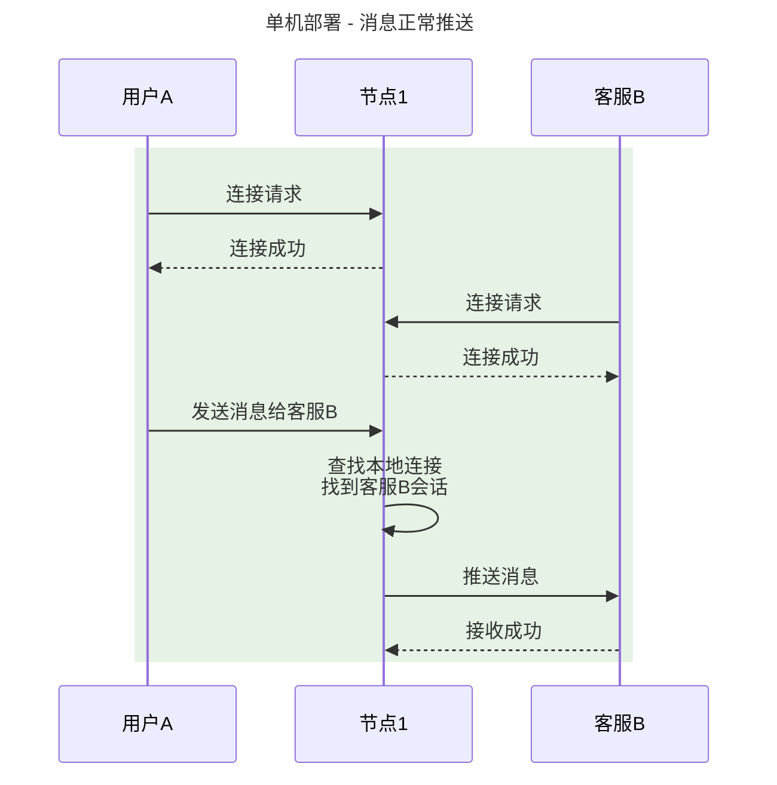
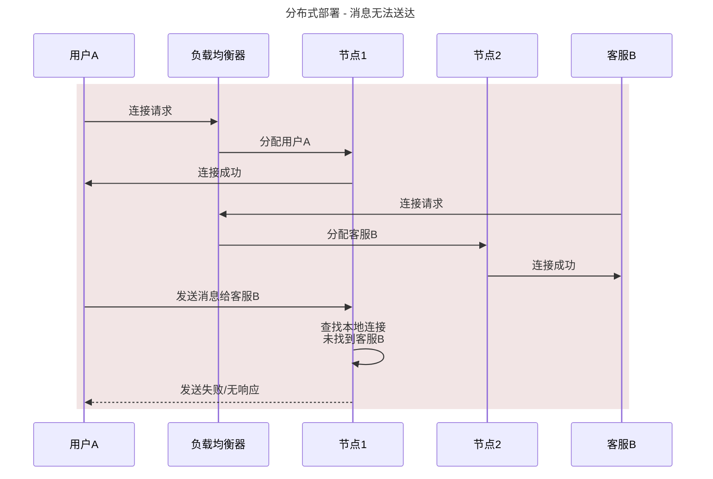
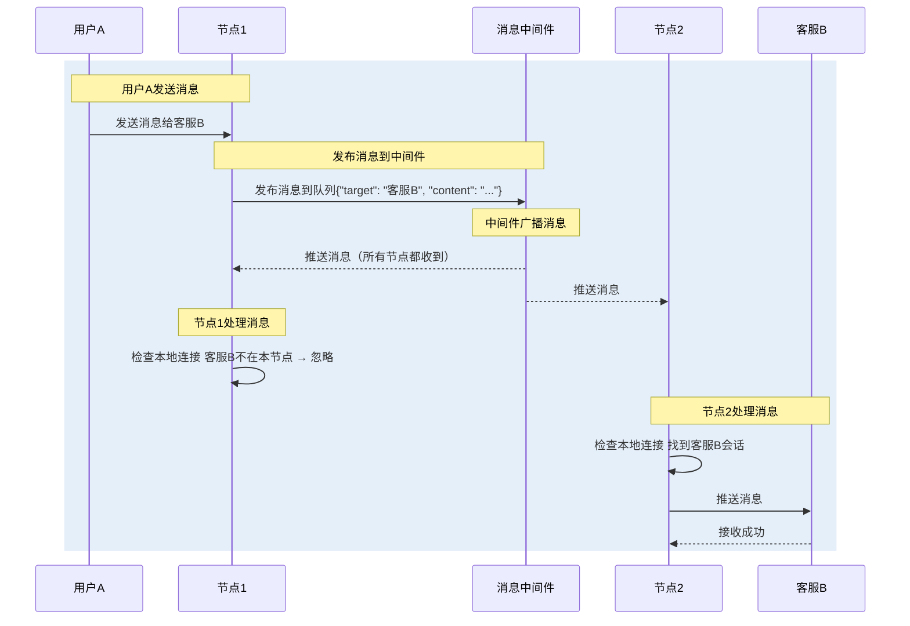
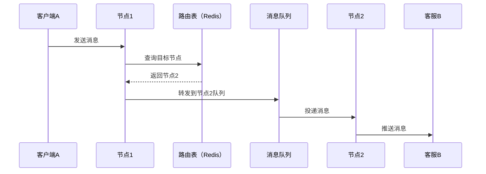

参考：
https://zhuanlan.zhihu.com/p/258097038
https://lawrenceli.me/blog/websocket-cluster#%E7%AE%80%E5%8D%95%E5%B9%BF%E6%92%AD%E5%AE%9E%E7%8E%B0-websocket-%E9%9B%86%E7%BE%A4

# 单例WebSocket回顾

示例代码没有使用 `Spring Boot` 集成，是使用 `javax.websocket` API 实现的单例 WebSocket 应用。这是一个简单的例子，实际使用上可以添加心跳检测机制、异步广播、清理无效会话等功能；

```java
import javax.websocket.*;
import javax.websocket.server.ServerEndpoint;
import java.io.IOException;
import java.util.concurrent.ConcurrentHashMap;

@ServerEndpoint("/chat") // WebSocket 服务端点
public class SimpleWebSocketServer {

    // 使用 ConcurrentHashMap 存储所有连接会话
    // Key: 会话ID (String), Value: WebSocket会话对象 (Session)
    private static final ConcurrentHashMap<String, Session> sessions = 
        new ConcurrentHashMap<>();
    
    /**
     * 当新客户端连接时调用
     */
    @OnOpen
    public void onOpen(Session session) {
        // 将新会话添加到Map
        sessions.put(session.getId(), session);
        
        System.out.println("新客户端连接: " + session.getId());
        sendMessage(session, "欢迎加入聊天室! 你的ID: " + session.getId());
        broadcast("系统消息: 用户 " + session.getId() + " 加入聊天室");
    }
    
    /**
     * 当收到客户端消息时调用
     */
    @OnMessage
    public void onMessage(String message, Session sender) {
        System.out.println("收到消息 [" + sender.getId() + "]: " + message);
        
        // 广播消息给所有客户端
        broadcast("用户 " + sender.getId() + ": " + message);
    }
    
    /**
     * 当客户端断开连接时调用
     */
    @OnClose
    public void onClose(Session session, CloseReason reason) {
        // 从Map中移除会话
        sessions.remove(session.getId());
        
        System.out.println("客户端断开: " + session.getId() + ", 原因: " + reason.getReasonPhrase());
        broadcast("系统消息: 用户 " + session.getId() + " 离开聊天室");
    }
    
    /**
     * 错误处理
     */
    @OnError
    public void onError(Session session, Throwable throwable) {
        System.err.println("连接错误: " + session.getId());
        throwable.printStackTrace();
    }
    
    /**
     * 广播消息给所有客户端
     * @param message 要发送的消息
     */
    private void broadcast(String message) {
        // 遍历所有会话并发送消息
        sessions.forEach((id, session) -> {
            if (session.isOpen()) {
                sendMessage(session, message);
            }
        });
    }
    
    /**
     * 发送消息给单个客户端
     * @param session 目标会话
     * @param message 要发送的消息
     */
    private void sendMessage(Session session, String message) {
        try {
            // 使用异步方式发送，避免阻塞
            session.getAsyncRemote().sendText(message);
        } catch (Exception e) {
            System.err.println("发送消息失败: " + e.getMessage());
        }
    }
}
```

重写的方法：
- onOpen：在客户端与WebSocket服务连接时触发方法执行
- onClose：在客户端与WebSocket连接断开的时候触发执行
- onMessage：在接收到客户端发送的消息时触发执行
- onError：在发生错误时触发执行

流程：
1. 客户端与服务端建立 TCP 连接，使用 HTTP 协议升级为 WebSocket 协议连接到服务端的 `/chat` 端点，触发 `onOpen` 方法；
2. 客户端以 WebSocket 数据帧的形式发送消息；
3. 服务端的 `onMessage` 方法被触发；
4. 服务端使用 WebSocket Session 进行数据发送；
5. 若客户端主动下线，触发 `onClose`；若通信时网络中断触发 `onError`；

# 单例和分布式WebSocket的区别

一图流：

| **对比维度** | **单例环境**                           | **分布式环境**                | **问题根源**                                  |
| -------- | ---------------------------------- | ------------------------ | ----------------------------------------- |
| **连接管理** | 单节点内存维护所有连接（如 `ConcurrentHashMap`） | 连接分散在多个节点，无全局视图          | WebSocket 的 Session 基于 TCP 连接，无法跨节点序列化或共享 |
| **消息路由** | 直接遍历本地连接推送消息                       | 需跨节点定位目标连接，否则部分用户收不到消息   | 用户连接可能分布在任意节点，发送方节点无法直接访问接收方连接            |
| **负载均衡** | 无需考虑连接分布                           | 新增/减少节点时连接分配不均（如轮询算法）    | 持久连接无法像 HTTP 请求那样动态重分配到新节点                |
| **会话状态** | Session 绑定到本地内存                    | Session 状态需外部存储（如 Redis） | WebSocket Session 包含 TCP 连接信息，无法在集群间迁移    |

分析：
WebSocket 是有状态的协议，每个连接是绑定到特定服务器节点的。

单体应用下只有一台服务器，所有的客户端连接的都是这一台消息服务器，所以当发布消息者发送消息时，所有的客户端其实已经全部与这台服务器建立了连接，直接群发消息就可以了。

换成分布式系统后，如果客户端连接的服务器发生故障或负载均衡切换，其他节点无法获取该连接的状态。

如：客服系统单机部署时，用户A与客服B连接同一节点，消息可正常推送；分布式部署后，若用户A连接节点1，客服B连接节点2，则用户A的消息无法到达客服B。

单机应用下不会出现通信问题：


分布式下出现通信问题：


>Q: WebSocket 连接通过 Nginx 通过 Gateway 再到服务器，连接上之后就不会再走 Nginx 和Gateway 的均衡负载选择后端服务器了吗？
>
>A: 连接建立后，WebSocket 数据仍需经过 Nginx 和 Gateway，因为它们作为代理维持了 TCP 长连接，会持续作为中间代理，转发所有数据帧，但不再重新选择服务器节点（除非连接中断或主动切换）

# 常见解决方案

## 广播模式

原理：
使用消息队列进行广播。
在接收到消息时，不是直接通过 WebSocket 发送消息给对应客户端，而是发布消息到中间件（如 Redis Pub/Sub、RabbitMQ），所有节点消费并判断是否需处理本地连接。

优点：实现简单，扩展性强。

缺点：网络流量大（消息被所有节点消费），给所有节点带来压力。



## 路由模式

原理：
中央路由表+精准投递。

如：连接时存储（用户ID, 节点ID）映射关系存储到路由表，发送消息时根据对方客户端所在的节点ID作为消息队列 `RoutingKey`，精确推送到目标节点的专属队列。

优点：精准投递，网络高效，消息只发送到目标节点。

缺点：
1. 路由表依赖，Redis宕机导致系统不可用；
2. 状态不一致，客户端意外断开重连到新节点而路由表未更新——可以通过缓存过期续期那一套解决；
3. 节点1宕机后重启，用户2重新连接到了一个节点2，此前若有等待被发到用户2的消息，那么仍是节点1的专属队列，节点1正要给用户2发送消息时发现本地并没有这个 WebSoket Session，需要重新查询路由表投递给消息队列，导致延时增大；若节点1没恢复，消息则永远不会发送到用户2；



## 哈希环

不借助这些队列/订阅机制，通过哈希函数将用户ID映射到 WebSocket 服务器，实现消息的路由和推送。该方案可以有效减少消息广播带来的网络流量，并提高消息传递的效率。
需要通过心跳等机制，去维护节点的存活情况，保证路由到的 WebSocket 服务器节点可用。
